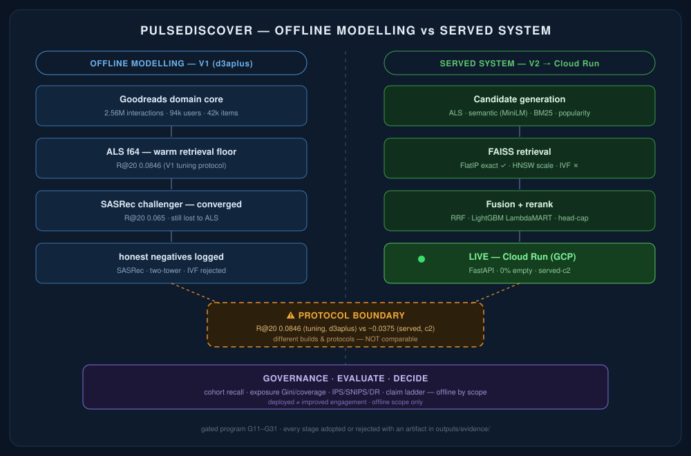
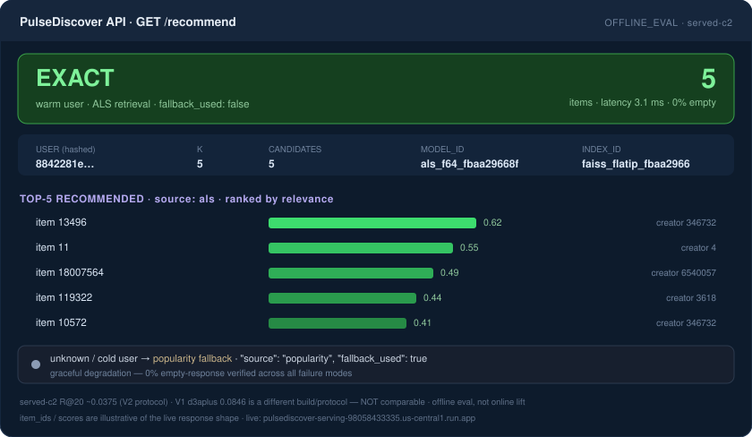

# PulseDiscover


**A two-stage recommender *decision* system on 2.56M real Goodreads interactions &mdash; built to answer one hard question: _which offline retrieval/ranking/serving "win" actually deserves to ship, and which ones are lying to you?_**

> Recommenders rarely fail because the model was wrong. They fail because a **metric improved while catalog health, candidate fidelity, or cold-start coverage silently collapsed** &mdash; and nobody measured the gap. PulseDiscover is the measurement layer that catches that gap before it reaches users.

**Metrics &mdash; offline floor:** `ALS R@20 0.085` &middot; `cold-lane R@20 0.241` &middot; `SASRec converged → lost` &nbsp;|&nbsp; **served-c2 lane:** `R@20 ~0.0375` &middot; `FlatIP lossless −47% p95` &middot; `0% empty-response` &middot; `Cloud Run: LIVE`

**Live:** `https://pulsediscover-serving-98058433335.us-central1.run.app`

---

## Architecture



Every stage was added, measured, and **adopted or rejected with an artifact** across a gated program (G11&ndash;G31). V1 set the offline modelling floor; the V2 lane (G22&ndash;G31) added serving, cold-start, exposure governance, learned fusion, executed off-policy evaluation, and a search/IR front end &mdash; then the serving path shipped to Cloud Run.

---

## Live endpoint

PulseDiscover serves the **c2 ALS model with exact FlatIP FAISS retrieval** over HTTPS. Warm users get personalized `als` results; unknown/cold users get a graceful popularity fallback &mdash; never empty.



```bash
curl https://pulsediscover-serving-98058433335.us-central1.run.app/health
# {"status":"ok","ready":true,"load_error":null}
```

> The live endpoint serves the **served-c2** model (R@20 ~0.0375 under the V2 protocol). The V1 `d3aplus` ALS result (R@20 0.0846) is a **different build and protocol** and is *not* what's deployed &mdash; see Truth Boundary.

---

## Failure mode addressed

This project is built around the failure modes of *recommender evaluation and serving*, named in advance:

- An **offline Recall@K win that worsens catalog health** &mdash; a recall bump while the long tail gets starved.
- An **ANN index that silently degrades the candidate pool** &mdash; gold recall survives while candidate fidelity collapses (IVF).
- A **single-held-out-gold metric that's blind to most of the slate changing** &mdash; so the visible number can't see the damage.
- **Cold-start measured as a recall drop** when the real cost is coverage/personalization collapse.
- **Cross-protocol metric conflation** &mdash; quoting a tuning-set number as if it were the served-model number.

Each is detected by an explicit check (overlap@K, exposure Gini, cohort separation, a model/protocol registry), not by hope.

---

## Eval results (offline, protocol-tagged)

| Result | Number | Protocol |
|---|---|---|
| ALS warm floor | R@20 **0.085** | V1 d3aplus tuning |
| Canonical SASRec, converged | R@20 0.065 (**lost to ALS**) | V1 &mdash; honest negative |
| Content-hybrid cold lane | cold R@20 **0.241** (ALS = 0) | V1 cold-start |
| FAISS FlatIP (exact) | lossless, ~**47%** lower p95 | V2 latency |
| FAISS HNSW ef64 | overlap **0.992**, ~2.4&times; | V2 latency |
| FAISS IVF | **rejected** &mdash; overlap collapsed 0.28&ndash;0.78 | V2 |
| Cold-start fallback cost | coverage **~59&times;** collapse; personalization 0.68&rarr;**0.001** | V2 served-c2 |
| Semantic cold-start reach | **54.6%** of unseen golds (ALS/pop = 0) | V2 served-c2 |
| Learned fusion vs ALS-only | test R@20 **0.036 vs 0.022**; cold 0.032 vs 0 | V2 &mdash; held-out test, 81 positives |
| Off-policy evaluation | DR **0.0089** vs true 0.0106; SNIPS stable; IPS over-estimates | V2 &mdash; offline, proxy reward |
| Exposure concentration | all policies Gini **&gt; 0.97**; popularity 0.9995 | V2 &mdash; concentration, not fairness |
| Search/IR hybrid | BM25 **0.0133** &gt; dense 0.0067; RRF hybrid 0.0117 | V2 &mdash; seed-item, NDCG/MRR |
| Serving | warm p95 **~3.3 ms** (local), **0%** empty | V2 load test |

---

## Gate ladder (V2: G22&ndash;G31)

| Gate | What shipped | Verdict |
|---|---|---|
| G22 | FAISS latency&ndash;quality frontier (FlatIP / HNSW / IVF) | FlatIP default, IVF rejected |
| G23 | Production-shaped FastAPI serving + load test | 0% empty, p95 ~3.3ms |
| G24 | Cold-start / sparse-cohort fallback quality | coverage collapse ~59&times; |
| G25 | Catalog exposure governance (Gini / coverage) | concentration measured |
| G26A/B | Decision-architecture spine + heuristic exposure rerank | quarantine closed |
| G27 | Semantic content retrieval (MiniLM + FAISS) | cold-start reach 54.6% |
| G28 | Learned ALS+semantic fusion tournament (LambdaMART) | beat ALS-only on test |
| G29 | Off-policy evaluation executed (IPS / SNIPS / DR) | estimators validated |
| G30 | Final RiskFrame audit + interview kit | offline gold-complete |
| G31 | Search/IR front end (BM25 + dense + RRF, NDCG/MRR) | role coverage added |

---

## Truth Boundary

| Real (built & measured) | Simulated / proxy | NOT claimed |
|---|---|---|
| 2.56M-interaction Goodreads dataset, temporal split | OPE propensities are synthetic (logging policy we control) | online lift / engagement / A/B impact |
| ALS, SASRec, content, semantic, BM25 retrieval | OPE reward is a held-out-gold proxy, not real clicks | production *quality* (deployed &ne; effective) |
| FAISS serving + load test | small positive count in fusion eval (81 test positives) | solved cold-start / solved long-tail |
| Cloud Run deployment (live HTTPS) | &mdash; | fairness certification (exposure = concentration only) |
| Cohort recall, exposure Gini, NDCG/MRR, IPS/SNIPS/DR | &mdash; | LLM recommender / "semantic taste" |
| Gate-by-gate audit history | &mdash; | learned-fusion-beats-ALS beyond the offline test split |

**Protocol boundary:** V1 `d3aplus` (R@20 0.0846) and served-`c2` (R@20 ~0.0375) are different builds and protocols &mdash; **never comparable.** Kept in `docs/G26A_MODEL_PROTOCOL_REGISTRY.md`.

---

## Stack

| Layer | Technology |
|---|---|
| Warm retrieval | ALS implicit matrix factorization &middot; 64 factors |
| Semantic (cold) retrieval | sentence-transformers `all-MiniLM-L6-v2` &middot; 384-dim &middot; FAISS FlatIP |
| Lexical retrieval | BM25Okapi (`rank_bm25`) &middot; query-by-document |
| Fusion / rank | Reciprocal Rank Fusion (RRF, k=60) &middot; LightGBM **LambdaMART** |
| ANN serving | FAISS &mdash; IndexFlatIP (exact) &middot; IndexHNSWFlat (scale) |
| Off-policy eval | IPS &middot; SNIPS &middot; Doubly-Robust |
| Evaluation | cohort Recall@K &middot; NDCG@K &middot; MRR &middot; Gini / catalog coverage |
| API | FastAPI + uvicorn |
| Deployment | Docker + GCP Cloud Run (512 MiB / 1 vCPU, exact FlatIP) |
| Corpus | Goodreads fantasy/paranormal (UCSD book graph) &middot; 2.56M interactions &middot; 94k users &middot; ~42k items (40,541 in the served ALS catalog) |

---

## Failures I'm proud of

The interview value of a project is the failures you catch yourself. Five-plus documented post-mortems in `docs/PULSEDISCOVERY_FAILURES_AND_HARDENING.md`:

- **SASRec false convergence** &mdash; an all-NaN val-loss curve silently satisfied early-stopping patience while the model was still learning; rejected and rebuilt the monitor on an eval-R@20 plateau.
- **IVF "the metric can lie"** &mdash; gold Recall@20 stayed flat while candidate-overlap vs exact collapsed to 0.28&ndash;0.78; rejected IVF, made overlap@K an acceptance check.
- **ID-dtype silent zeroing** &mdash; string-vs-int `book_id` keys made every lookup miss and recall floor to ~0 *while the pipeline ran clean*; caught with an overlap sanity check.
- **DR went negative** &mdash; a class-balanced reward model over-predicted vs a ~1% base rate and broke Doubly-Robust OPE; fixed with a base-rate-calibrated model (DR then lowest-bias).
- **G24 recall non-monotonicity** &mdash; cold cohorts scored *higher* recall than warm; refused the expected story and reframed the real cost as coverage/personalization collapse.

---

## Quick start

```bash
pip install -r requirements.txt

# serving API locally (exact FlatIP, HNSW off — the deployed config)
cd src && PD_DATADIR=../data/interim PD_BUILD_HNSW=0 uvicorn serving.api:app --port 8080
curl localhost:8080/health                              # {"status":"ok","ready":true}
curl "localhost:8080/recommend?user_id=<known>&k=5"     # 5 items, source:als
```

Large derived artifacts (ALS factors, embeddings, raw CSVs) are **not committed** (size / GitHub limits); `scripts/` builds each from the public Goodreads dataset. One-command Cloud Run deploy + spec in `deploy/DEPLOY.md`.

---

## Evidence artifacts

Every claim maps to a JSON in `outputs/evidence/`. A sample of what each proves:

| Artifact | Proves |
|---|---|
| `g22_faiss_latency_quality_report.json` | FlatIP lossless &minus;47% p95; HNSW near-lossless; IVF overlap collapse |
| `g23_serving_api_report.json` | production-like API, 0% empty, failure-mode coverage |
| `g24_cold_start_sparse_cohort_report.json` | fallback coverage collapse ~59&times;, personalization 0.68&rarr;0.001 |
| `g25_catalog_exposure_governance_report.json` | exposure Gini/coverage; HNSW exposure-neutral |
| `g27_semantic_retrieval_report.json` | semantic reaches 54.6% of item-cold-start golds |
| `g28_final_ranker_fusion_decision.json` | learned fusion beats ALS-only on held-out test |
| `g29_ope_execution_report.json` | IPS/SNIPS/DR recover a known value offline |
| `g31_search_ir_report.json` | BM25 + dense + RRF with NDCG/MRR |
| `g30_final_gold_audit.json` | RiskFrame 9.1, offline gold-complete |

**Deeper docs:** `docs/78_CONTROL_TOWER.md` (status) &middot; `docs/PULSEDISCOVERY_INTERVIEW_KIT.md` (pitch + claim ladder) &middot; `docs/PULSEDISCOVERY_UNIFIED_DEFENSE_KERNEL.md` (method-by-method defense) &middot; **Interview defense PDF:** `defense/PulseDiscover_Interview_Defense.pdf`.

---

## Resume-safe claim

> Built **PulseDiscover**, an offline two-stage recommender decision system on 2.56M real Goodreads interactions (94k users, ~42k items; 40,541 in the served ALS catalog): tuned **ALS matrix factorization** to a warm-retrieval floor and *earned* it by showing a **converged full-softmax SASRec still lost**; built a **FAISS** latency&ndash;quality frontier (FlatIP exact default, HNSW scale, **IVF rejected** for candidate-overlap collapse); added a **dense semantic (MiniLM) cold-start lane** that uniquely reaches item-cold-start items and a **BM25** lexical lane; trained a **LightGBM LambdaMART fusion** ranker that beat ALS-only on the held-out test split; **executed off-policy evaluation** (IPS/SNIPS/DR) and measured **catalog-exposure governance** (Gini/coverage); and **deployed the FastAPI + FAISS serving path to GCP Cloud Run** &mdash; all under strict claim discipline with documented honest negatives and an explicit offline/online boundary.

---

## Portfolio

| Project | Focus |
|---|---|
| [pulsediscover](https://github.com/SidharthKriplani/pulsediscover) | **(this)** recommender / IR decision system + serving + OPE |
| [pulseagent](https://github.com/SidharthKriplani/pulseagent) | multi-agent RAG on LangGraph (MCP tools, NLI verification) |
| [pulseguard](https://github.com/SidharthKriplani/pulseguard) | ML credit-risk governance (champion/challenger, calibration, Cloud Run) |
| [pulseknowledge](https://github.com/SidharthKriplani/pulseknowledge) | RAG reliability harness (hybrid retrieval, citation entailment) |
| [all repositories &rarr;](https://github.com/SidharthKriplani?tab=repositories) | full portfolio |

*If a result isn't backed by an artifact in `outputs/evidence/`, it isn't claimed.*
