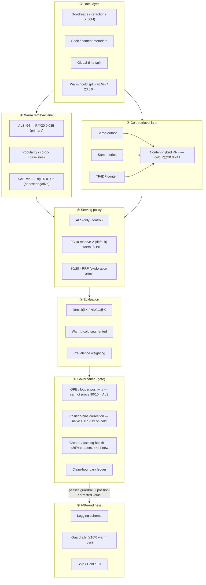

# 35 — ARCH1: Architecture / System Diagram Spec

**Diagram title:** *PulseDiscover: Two-Lane Recommender Experimentation System*

*One-page visual blueprint. A spec that can be rendered as Mermaid / draw.io / Excalidraw / PDF. No new claims — annotated numbers are all from prior gates. A ready-to-render Mermaid draft is in §5, and a standalone file at `docs/pulsediscover_architecture.mermaid`.*

---

## 1. Layout intent
Six stacked layers, top to bottom, with a left-to-right flow inside the retrieval band. Warm and cold lanes run in parallel and converge at the serving policy; evaluation and governance wrap the policy and gate the A/B-readiness output.

## 2. Main visual blocks

**① Data layer**
- Goodreads interactions (2.56M)
- Book / content metadata
- Global-time train/test split
- Warm / cold item split (prevalence 76.5% / 23.5%)

**② Warm retrieval lane**
- **ALS f64** *(primary — R@20 0.085)*
- Popularity / co-occurrence baselines *(secondary)*
- SASRec *(honest negative — R@20 0.036)*

**③ Cold retrieval lane**
- Same-author
- Same-series
- TF-IDF content
- **Content-hybrid (RRF)** *(cold R@20 0.241)*

**④ Serving policy**
- ALS-only *(control)*
- **90/10 reserve-2** *(default treatment — warm −8.1%)*
- 80/20 · RRF *(exploration arms)*

**⑤ Evaluation layer**
- Recall@K / NDCG@K
- Warm / cold segmented metrics
- Prevalence weighting (76.5 / 23.5)

**⑥ Governance layer**
- OPE / logger positivity *(cannot prove 90/10 > ALS-only)*
- Position-bias correction *(naive CTR under-credits cold 11×)*
- Creator / catalog health *(+26% creators, +444 new)*
- Claim-boundary ledger

**⑦ A/B-readiness layer**
- Logging schema
- Guardrails (≤10% warm loss)
- Ship / hold / kill

## 3. Data flow (arrows)
```
raw data → global-time split → warm/cold item split
   → warm lane (ALS f64) ┐
   → cold lane (hybrid)  ┘→ slate construction (two-lane policy)
   → offline evaluation (Recall/NDCG, segmented, prevalence-weighted)
   → governance checks (OPE · position-bias · catalog-health)
   → A/B-readiness spec (logging · guardrails · ship/hold/kill)
```
Governance is a **gate**, not a passthrough: a policy only reaches the A/B-readiness output if it clears the warm guardrail and its discovery value survives position-bias correction.

## 4. Numbers to annotate (established only)
| Block | Annotation |
|---|---|
| Warm lane | ALS f64 **R@20 0.085** |
| Cold lane | content-hybrid **cold R@20 0.241** (ALS = 0 by construction) |
| Serving policy | 90/10 warm loss **−8.1%** (≤10% guardrail) |
| Governance — position bias | naive CTR under-credits cold lane **11×** |
| Governance — health | **+26% creators / +444 new creators** (reach, not de-concentration) |
| Governance — OPE | **OPE cannot prove 90/10 > ALS-only** |

## 5. Mermaid draft


## 6. Caption
*This diagram shows PulseDiscover as an experimentation system, not just a model: warm and cold retrieval feed a two-lane serving policy, while OPE, position-bias correction, and catalog-health checks determine whether the policy is safe to A/B test.*

**STOP — awaiting ARCH1 review.**
